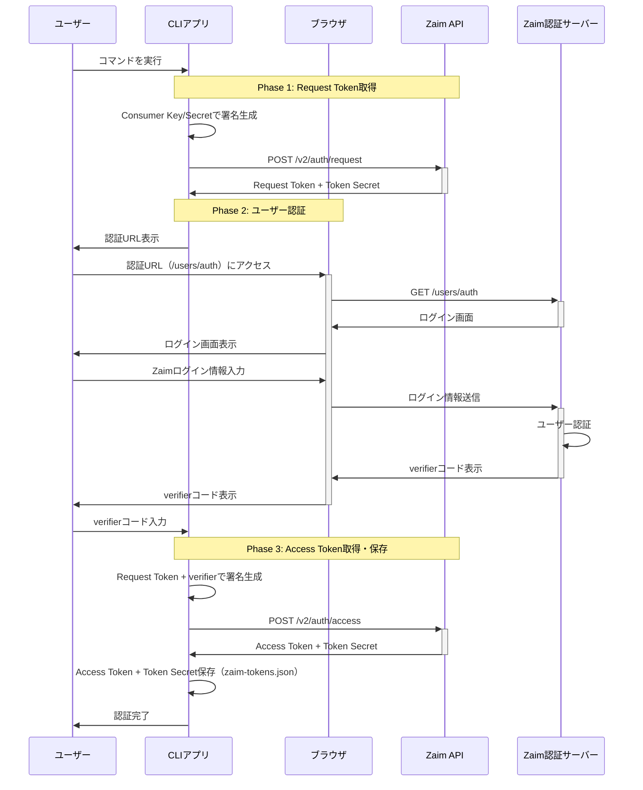
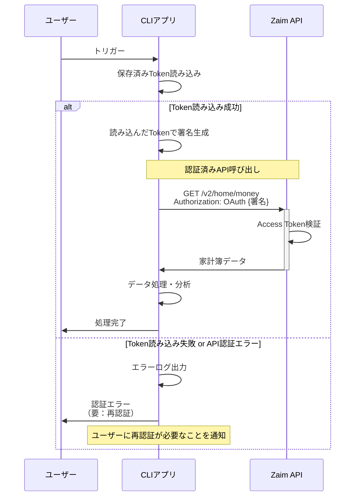

# zaim モジュール

## OAuth 1.0aを利用した認証

### 初回認証

ユーザーによる承認処理を経て、最終的にアクセストークンを取得・保存します。

```mermaid
sequenceDiagram
    participant User as ユーザー
    participant CLI as CLIアプリ
    participant Browser as ブラウザ
    participant ZaimAPI as Zaim API
    participant ZaimAuth as Zaim認証サーバー

    User->>CLI: コマンドを実行

    Note over CLI, ZaimAPI: Phase 1: Request Token取得
    CLI->>CLI: Consumer Key/Secretで署名生成
    CLI->>+ZaimAPI: POST /v2/auth/request
    ZaimAPI->>-CLI: Request Token + Token Secret

    Note over CLI, Browser: Phase 2: ユーザー認証
    CLI->>User: 認証URL表示
    User->>+Browser: 認証URL（/users/auth）にアクセス
    Browser->>+ZaimAuth: GET /users/auth
    ZaimAuth->>-Browser: ログイン画面
    Browser->>User: ログイン画面表示

    User->>Browser: Zaimログイン情報入力
    Browser->>+ZaimAuth: ログイン情報送信
    ZaimAuth->>ZaimAuth: ユーザー認証
    ZaimAuth->>-Browser: verifierコード表示
    Browser->>-User: verifierコード表示

    User->>CLI: verifierコード入力

    Note over CLI, ZaimAPI: Phase 3: Access Token取得・保存
    CLI->>CLI: Request Token + verifierで署名生成
    CLI->>+ZaimAPI: POST /v2/auth/access
    ZaimAPI->>-CLI: Access Token + Token Secret

    CLI->>CLI: Access Token + Token Secret保存（zaim-tokens.json）

    CLI->>User: 認証完了
```

### トークンを利用したAPI呼び出し

```mermaid
sequenceDiagram
    participant User as ユーザー
    participant CLI as CLIアプリ
    participant ZaimAPI as Zaim API

    User->>CLI: トリガー
    CLI->>CLI: 保存済みToken読み込み

    alt Token読み込み成功
        CLI->>CLI: 読み込んだTokenで署名生成
        
        Note over CLI, ZaimAPI: 認証済みAPI呼び出し
        CLI->>+ZaimAPI: GET /v2/home/money<br/>Authorization: OAuth {署名}
        ZaimAPI->>ZaimAPI: Access Token検証
        ZaimAPI->>-CLI: 家計簿データ

        CLI->>CLI: データ処理・分析
        CLI->>User: 処理完了
        
    else Token読み込み失敗 or API認証エラー
        CLI->>CLI: エラーログ出力
        CLI->>User: 認証エラー<br/>（要：再認証）
        
        Note over CLI: ユーザーに再認証が必要なことを通知
    end
```
